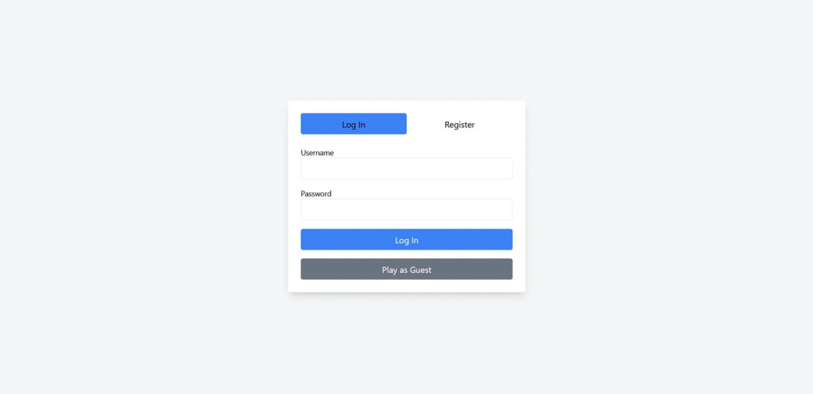
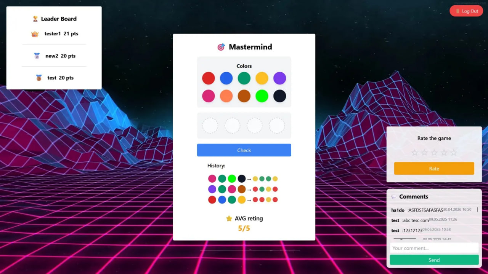
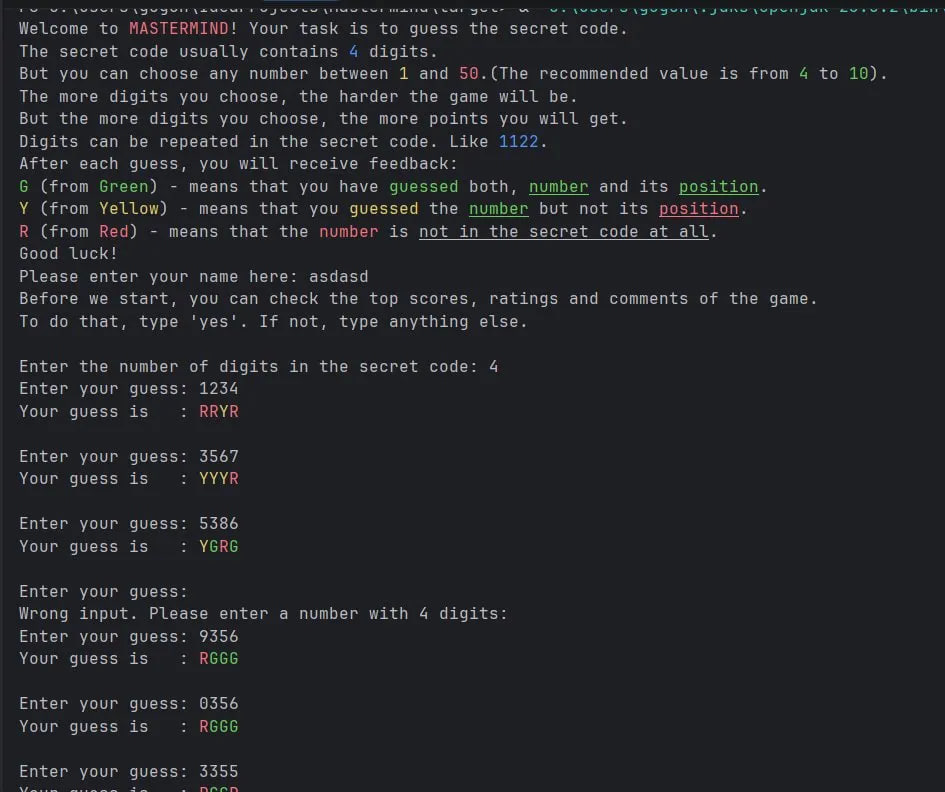

# 🎯 Mastermind

A full-stack implementation of the classic **Mastermind** code-breaking game, featuring both a **web version** (Spring Boot + Thymeleaf) and a **console version** (standalone Java), sharing a common backend and database.

---

## Screenshots

### Web Version
| Login | Game |
|-------|------|
|  |  |

### Console Version


---

## Features

### Web Version
- 🎨 Guess a secret sequence of **4 colors** chosen from 8 options
- 🔐 User authentication — register, log in, or play as guest
- 🏆 Global leaderboard with scores
- ⭐ Game rating system (1–5 stars)
- 💬 Comments section
- 📜 Guess history shown after each attempt

### Console Version
- 🔢 Choose the number of digits to guess — from **4 to 50** (more digits = more points)
- Digits can repeat in the secret code
- Color-coded feedback after each guess:
    - 🟢 **G (Green)** — correct digit, correct position
    - 🟡 **Y (Yellow)** — correct digit, wrong position
    - 🔴 **R (Red)** — digit not in the code at all
- View scores, ratings and comments before playing
- Submit your score and leave a comment after the game

---

## Tech Stack

| Layer | Technology |
|-------|-----------|
| Language | Java 17+ |
| Web Framework | Spring Boot 3.1, Thymeleaf |
| ORM | JPA / Hibernate |
| Database | PostgreSQL |
| Console DB | JDBC |
| Build | Maven |

---

## Getting Started

### Prerequisites
- Java 17 or higher
- PostgreSQL running locally

### Database Setup

Create a PostgreSQL database and update `src/main/resources/application.properties` with your credentials:

```properties
spring.datasource.url=jdbc:postgresql://localhost:5432/your_database
spring.datasource.username=your_username
spring.datasource.password=your_password
```

The schema is created automatically on first run (`spring.jpa.hibernate.ddl-auto=update`).

---

## Running the Project

### Option A — From Source (IntelliJ IDEA)

Open the project and run one of the following main classes:

| Mode | Main Class |
|------|-----------|
| Web server | `sk.tuke.gamestudio.server.GameStudioServer` |
| Console | `sk.tuke.gamestudio.Mastermind` |

Then open [http://localhost:8080](http://localhost:8080) for the web version.

### Option B — From JAR (release)

Download the latest `mastermind-x.x.x.jar` from [Releases](../../releases).

**Web version:**
```bash
java -jar mastermind-1.0.0.jar
```
Open [http://localhost:8080](http://localhost:8080) in your browser.

**Console version:**
```bash
java "-Dloader.main=sk.tuke.gamestudio.Mastermind" -jar mastermind-1.0.0.jar
```

> ⚠️ Both modes require PostgreSQL to be running with credentials matching `application.properties`.

---

## Project Structure

```
src/main/java/sk/tuke/gamestudio/
├── server/              # Spring Boot web server (GameStudioServer.java)
├── game/mastermind/
│   ├── core/            # Game logic (Game, CodeGenerator)
│   └── consoleui/       # Console UI (ConsoleUI.java)
├── entity/              # JPA entities (Score, Comment, Rating, User)
├── service/             # Service interfaces + JPA/JDBC implementations
└── Mastermind.java      # Console entry point (standalone, uses JDBC)
```

---

## Architecture Note

The project demonstrates two data access strategies on the same domain model:

- **Web mode** uses **JPA / Hibernate** for object-relational mapping
- **Console mode** uses **raw JDBC** for direct database access

A third mode (`SpringClient`) is also present — a Spring-based console client that communicates with the running web server via **REST API**, demonstrating a client-server architecture.